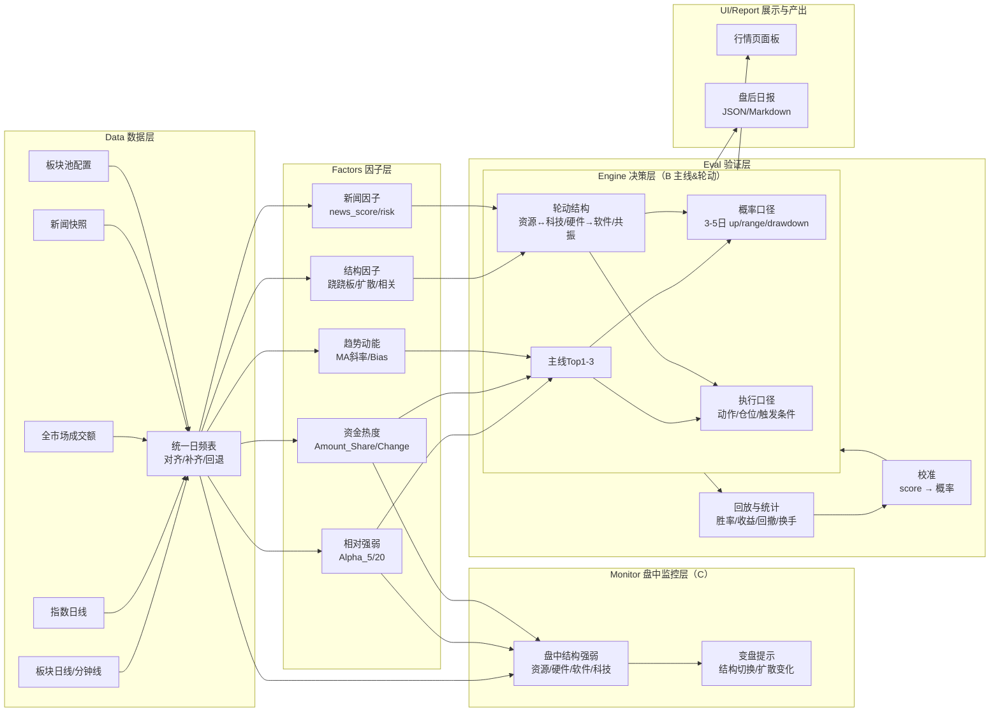

# 板块模块（主线&轮动）极简架构

目标：盘后生成“主线与轮动”的**可解释结论**，同时给出两种口径：**概率口径**与**执行口径**，并且每个因子都能进入回放验证。

---

## 1. 分层与边界

### 1) Data（数据层）
- 输入：板块日线/分钟线（可选）、指数日线（可选）、全市场成交额（可选）、新闻（可选）
- 输出：统一日频表（日期对齐、缺失补齐、非交易日回退），提供给因子层
- 约束：只做清洗与对齐，不做判断

### 2) Factors（因子层）
- 作用：从 Data 的统一表计算“指标/因子”，不输出操作建议
- 输出：面向后续 Engine/Eval 的结构化因子字典
- 约束：因子要“可回放”，不可依赖不可复现的即时数据（允许盘后快照落盘）

### 3) Engine（决策层：B 主线&轮动）
- 作用：把因子组合成“主线TopN + 轮动结构 + 未来倾向 + 触发条件”
- 输出：盘后“定稿快照”（见第3节），供 UI/日报/回测复用
- 约束：不直接抓数据，不直接画图

### 3.5) Monitor（盘中监控层：C）
- 作用：交易时间内输出少量“结构变化信号”，用于**及时发现变盘/切换**，不影响盘后定稿引擎
- 输出：盘中监控字段（见第3节），供 UI 轻量展示（一个字段+一张图即可）
- 约束
  - 不输出盘后概率/回测口径，只输出监控信号与可解释数据
  - 交易时间刷新；盘后冻结/不刷新
  - 不写入盘后定稿文件，避免“盘中噪声污染复盘”

### 4) Eval（验证层）
- 作用：对“因子/规则/输出字段”做历史回放，产出胜率、收益、回撤、换手、失败样本
- 输出：统计表 + 失败案例列表（用于迭代阈值与权重）
- 约束：验证层是唯一能决定“因子是否保留”的地方

### 5) UI/Report（展示与产出）
- UI：展示 Engine 输出 + 少量关键因子（用于解释）
- Report：盘后生成一页“主线与轮动日报”（Markdown/JSON 都可）

---

## 2. 数据契约与命名规范

### 2.1 必需数据（第一阶段就用）
- 板块日线：收盘价、成交额（至少有收盘价；成交额缺失可降级）
- 板块池：20-30个（用户可自选）
- 交易日对齐：非交易日回退到最近交易日

### 2.2 建议数据（逐步补齐）
- 指数（日线）：上证/深证/创业/科创（用于动态基准与共振）
- 全市场成交额：用于 Amount_Share 口径更准
- 新闻：用于事件加权（见第5节）

### 2.3 自选池字段契约（主视图固定 6 项）
说明：自选池卡片主视图只固定展示 6 项，其它字段进“展开详情”。

| 展示名 | 输出字段位置 | key | 单位/格式 | 说明 |
|---|---|---|---|---|
| 动能 | lifecycle item 顶层 | `动能` | 文本枚举 | 例：强势向上/中性震荡/弱势向下 |
| 资金行为 | lifecycle item 顶层 | `资金行为` | 文本枚举 | 例：放量启动/横盘整理/资金撤退 |
| Alpha_5 | lifecycle item 指标数据 | `指标数据.alpha_5` | `%`（数值） | 5日超额收益（相对基准） |
| 乖离率(5日) | lifecycle item 指标数据 | `指标数据.bias_5` | `%`（数值） | 5日乖离率；前台统一显示“乖离率” |
| 热度变化 | lifecycle item 指标数据 | `指标数据.Amount_Share_Change` | 数值（无单位） | 成交额占比变化（相对变化） |
| 趋势 | 前端派生（自选池） | `watchIntradayRows.tag` | 文本枚举 | 用“昨/今”涨跌幅变化生成：修复转强/转强/转弱/今日强势/今日走弱 |
| 动作 | lifecycle item 顶层/exec_view | `操作建议` / `exec_view.action` | 文本枚举 | 例：建仓/持有/减仓/观望/回避 |

命名约束：
- UI 文案统一使用“乖离率”三字，不展示 Bias
- 概率、分值、校准信息不进入自选池主视图

趋势（前端派生）规则（v1）：
- 输入：`昨`（昨日涨跌幅）、`今`（当日/盘中涨跌幅，若有分钟线则用分钟线末值）
- 输出（命中其一）：
  - 昨 ≤ -1 且 今 ≥ 0.5：`修复转强`
  - 昨 < 0 且 今 > 0：`转强`
  - 昨 > 0 且 今 < 0：`转弱`
  - 今 ≥ 1：`今日强势`
  - 今 ≤ -1：`今日走弱`

---

## 3. Engine 输出契约（固定字段）

统一输出一个对象（盘后快照），字段必须稳定；同时支持一个“盘中监控”对象（不影响盘后快照）。

### 3.1 总览（结构结论）
- `day`: 交易日
- `mainline`: 主线Top1-3（每条含：阶段/动能/资金行为、概率口径、执行口径、触发条件）
- `rotation`: 轮动结构（资源/科技跷跷板、硬件→软件扩散、共振）
- `groups`: 分组摘要（用于解释“结构偏向”）

### 3.2 每条主线的两种口径

每条主线输出两份结论：

1) 概率口径 `prob_view`（用于“预判”）
- 未来3-5天：`up_prob / range_prob / drawdown_risk`（0-100）
- 风险标签：例如 `赶顶`、`撤退`、`恐慌`、`背离`

2) 执行口径 `exec_view`（用于“明天怎么做”）
- 建议动作：`建仓/持有/减仓/观望/回避`
- 仓位建议：`0~1`（区间或单值）
- 触发条件（两条足够）：`confirm` / `invalidate`

### 3.3 可解释性字段（必须）
- `why`: 一句话归因（动能 + 资金行为 + 相对强弱）
- `key_factors`: 3-5个关键因子值（只保留最有用的）

### 3.4 分值（仅内部使用，不对外展示）
- 可保留 `_score` 作为内部排序/校准索引，但 UI 默认不展示
- UI 面向用户只展示：阶段/动能/资金行为 + 概率口径 + 执行口径 + 触发条件

### 3.5 盘中监控输出（C 层，最小字段）
盘中监控只解决“有没有结构变化/变盘迹象”，避免复杂化：

- `day`: 交易日
- `ts`: 毫秒时间戳
- `intraday`
  - `bars`: 用于柱状图的组别数组（默认两组：资源、科技；可切细分：资源/硬件/软件）
    - 每项：`{ group, today_pct, heat_change }`
  - `signal`: 一句话盘中信号（例：资源转强；硬件领涨；软件补涨出现；扩散减弱）
  - `reason`: 1-2 条原因（例：资源组 today_pct 领先且热度变化扩大）

---

## 4. 因子到输出的映射（极简规则）

先不追求复杂模型，先把“可回放且稳定”的因子变成两套口径：

### 4.1 核心因子（第一优先级）
- 相对强弱：Alpha_5 / Alpha_20
- 资金热度：Amount_Share / Amount_Share_Change
- 趋势/动能：MA5_Slope、Close vs MA5、Bias_20
- 结构：分组均值得分（资源 vs 科技；硬件 vs 软件）

### 4.2 概率口径（建议做成“分段+校准”）
- 用历史回放把 `score` → `up_prob`（分桶统计：score区间内未来3/5日上涨比例）
- 这样概率是“数据校准来的”，不是拍脑袋

### 4.3 执行口径（建议做成“门控”）
- 先用动能+资金行为决定动作（类似生命周期矩阵）
- 再用结构结论（跷跷板/扩散/共振）做加减分与仓位上限

---

## 5. 轮动可视化规范（盘中监控）

### 5.1 柱状图口径（盘中）
- 目标：快速看“资源/科技/（细分组）谁在走强”，并能提示结构切换
- 指标（每个组输出两个值）：
  - `today_pct`：组内板块“今日涨跌/今日进度”均值（盘中实时）
  - `heat_change`：组内板块 `Amount_Share_Change` 均值（盘中可用则展示；不可用可置空）
- 排序规则：
  1) 先按 `today_pct` 从高到低
  2) 若接近（例如差值 < 0.2%），再按 `heat_change` 从高到低

### 5.2 细分切换规则
- 默认视角：两组（资源、科技）
- 切换视角：三组（资源、硬件、软件）
- 分组规则来源：用户在“关注板块管理”中配置的板块归类（见第7节）

---

## 6. Top1-3 主线挑选规则（阶段信号优先）

目标：Top1-3 是“能解释+能执行”的主线，不以单一分值对外呈现。

### 6.1 候选筛选（先过滤）
- 一票否决（任意命中即剔除）：
  - 操作建议为“回避/离场/止损”类
  - 新闻风险标签命中高风险（如黑天鹅/地缘/监管强冲击），且没有对冲/仓位上限（规则门控未落地时先剔除）
- 数据缺失剔除：
  - Alpha_5 缺失且动能/资金行为无法判定

### 6.2 优先级排序（阶段信号优先）
优先级建议（从高到低）：
1) 动能为“强势向上/偏强向上”且资金行为为“放量启动”
2) 动能为“强势向上/偏强向上”且资金行为为“横盘整理/趋势延续”
3) 动能为“中性震荡/弱势反弹”但 Alpha_5 明显为正、热度变化转正（属于“启动/修复”）
4) 其它（默认不进 Top1-3）

同档位的 tie-break：
- 先比 Alpha_5
- 再比热度变化（Amount_Share_Change）

### 6.3 对外展示口径
- 不展示分值
- 展示：动能、资金行为、Alpha_5、乖离率、热度变化、动作、触发条件

---

## 7. 关注板块管理（前台入口与数据落盘）

目标：前台提供一个入口：
- 增加/删除关注板块
- 给每个关注板块归类到：资源/硬件/软件（后续可扩展科技等）

推荐落盘方案（便于复现与扩展）：
- `data/sector-watch.json`
  - `watch_list`: 字符串数组（板块名称）
- `data/sector-profile.json`
  - `groups`: `{ "半导体": "硬件", "云计算": "软件", "有色金属": "资源" }`

接口建议：
- 读取：现有 `/api/sector/watch-list` 返回 `watch_list`
- 扩展（建议新增）：`/api/sector/profile` 读写 `sector-profile.json`

---

## 8. 新闻因子（占位但要可插拔）

新闻还没做完没关系，但要先定接口形态：

### 5.1 NewsFactor 输入
- 盘后汇总：按板块聚合的新闻统计（数量、情绪、重要度、主题）
- 输出：`news_score`（正负）、`news_risk`（黑天鹅/地缘/监管等标签）

### 5.2 NewsFactor 如何影响 Engine
- 作为“风险门控”优先级高：高风险时降低仓位上限、提高 invalidate 触发敏感度
- 作为“加权项”优先级次之：同等条件下提高/降低 up_prob

---

## 9. 轮动实现拆分（按文档逐条落地）

### 9.1 盘中字段最小化接入
- 在“主线&轮动（盘后）卡”新增一个盘中字段（如：盘中结构=资源强/科技强），只在交易时段刷新
- 验收：盘中会变化；盘后主线结论不被盘中噪声覆盖

### 9.2 资源/科技柱状图（盘中）
- 先做 2 根柱（资源、科技），口径按第5节
- 验收：能渲染、能随盘中数据变化

### 9.3 细分切换
- 增加按钮切换到资源/硬件/软件（按第5节）
- 验收：切换后柱状图按细分重排

### 9.4 60 交易日“轮动顺序/主线段”统计（盘后）
- 定义：连续≥3天为主线段；2-3天为题材段
- 输出：先落盘 JSON/文本摘要，前端后挂
- 验收：生成一份可读的“轮动序列摘要”

---

## 10. 与当前仓库的最小落点（现状对齐）

当前实现已具备最小闭环：
- Data+Factors+Engine（部分）：[fetch_sector_data.py](file:///Users/una5577/Documents/trae_projects/a-stock-monitor/fetch_sector_data.py)
  - 生命周期输出：`lifecycle_dynamic`
  - 主线&轮动输出：`rotation_dynamic`
- API：`/api/sector/rotation` [server.js](file:///Users/una5577/Documents/trae_projects/a-stock-monitor/server.js)
- UI：行情页左侧“主线&轮动（盘后）”卡片 [index.html](file:///Users/una5577/Documents/trae_projects/a-stock-monitor/public/index.html)

下一步补齐的关键不是“再加因子”，而是：
- 让盘后 Engine 输出补齐 `prob_view/exec_view/trigger` 固定字段（并确保 UI 不展示分值）
- 增加盘中 Monitor（C）字段与柱状图（按第9节逐条落地）
- 加一套 Eval 回放把 score→概率校准出来
- 新闻模块完成后按第5节接入
