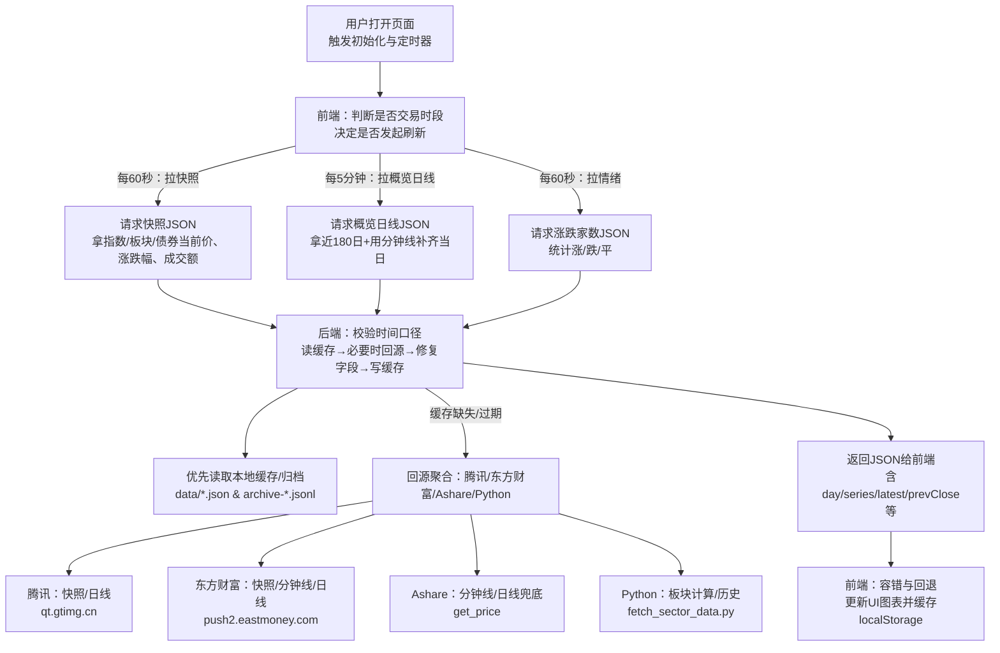
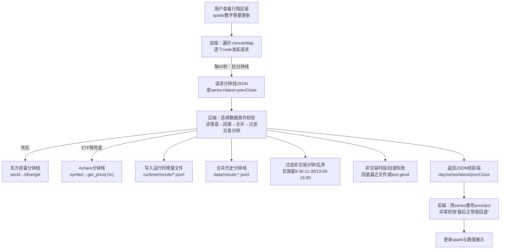

# 概览&行情&板块数据说明（数据源与代码口径）

本文仅覆盖三个页面域：概览（快照+日线概览）、行情（分时分钟线）、板块（排行/历史/生命周期/轮动）。时间口径均以北京时间（Asia/Shanghai）为准。

## 0. 数据从请求到展示的工作流程

### 0.1 总览流程（你用这段流程核查“请求的数据对不对”）

1. 浏览器加载页面（`public/index.html`）并执行前端逻辑（`public/ui.js`）。
2. 前端定时发起请求（交易时段更密，非交易时段应停更；见第 3 节规则）：
   - 快照：`/api/snapshot/latest`
   - 分时：`/api/minute/:code`
   - 涨跌家数：`/api/market/breadth`
   - 日线概览：`/api/overview/history`（频率更低）
   - 板块模块：`/api/sector/*`（仅在板块页/需要时）
3. Node 后端（`server.js`）收到请求后按“缓存优先 → 回源拉取 → 落盘缓存 → 返回 JSON”的顺序处理。
4. 若涉及板块计算/历史拉取，Node 会调用 Python（`fetch_sector_data.py`）输出 JSON（AkShare 为主）。
5. 前端拿到 JSON 后做轻量归一化与容错，并更新页面图表与数值（ECharts/DOM）。

### 0.2 你如何一眼判断“数据是不是对的”

- 先看“这条数据应该来自哪个源”（第 2 节表格），再看“应该满足哪些规则”（第 3-4 节）。
- 任意一条展示数据，都能对应到：前端请求 URL → 参数（code/sector/days）→ 后端源（东方财富/Tencent/Ashare/AkShare）→ 缓存文件（若有）。

### 0.3 Mermaid：概况（快照+概览日线）流程图

下方给两种形态：可编辑的 Mermaid 源码 + 可直接看的贴图（用于你我对齐）。

如果 Markdown 预览不渲染 mermaid，可直接打开这两个纯 mermaid 文件查看：
- [overview_flow.mmd](file:///Users/una5577/Documents/trae_projects/a-stock-monitor/docs/mermaid/overview_flow.mmd)
- [market_flow.mmd](file:///Users/una5577/Documents/trae_projects/a-stock-monitor/docs/mermaid/market_flow.mmd)

贴图（概况流程）：

![概况流程图](https://mermaid.ink/img/Zmxvd2NoYXJ0IFRECiAgVVvnlKjmiLfmiZPlvIDpobXpnaI8YnIvPuinpuWPkeWIneWni+WMluS4juWumuaXtuWZqF0gLS0+IEZFW+WJjeerr++8muiuoeeul+aYr+WQpuS6pOaYk+aXtuautTxici8+5Yaz5a6a5piv5ZCm5Y+R6LW35Yi35pawXQogIEZFIC0tPnzmr482MOenku+8muaLieW/q+eFp3wgU05BUFvor7fmsYLlv6vnhadKU09OPGJyLz7mi7/mjIfmlbAv5p2/5Z2XL+WAuuWIuOW9k+WJjeS7t+OAgea2qOi3jOW5heOAgeaIkOS6pOminV0KICBGRSAtLT585q+PNeWIhumSn++8muaLieamguiniOaXpee6v3wgT0hb6K+35rGC5qaC6KeI5pel57q/SlNPTjxici8+5ou/6L+RMTgw5pelK+eUqOWIhumSn+e6v+ihpem9kOW9k+aXpV0KICBGRSAtLT585q+PNjDnp5LvvJrmi4nmg4Xnu6p8IEJSW+ivt+axgua2qOi3jOWutuaVsEpTT048YnIvPue7n+iuoea2qC/ot4wv5bmzXQogIFNOQVAgLS0+IEJFW+WQjuerr++8muagoemqjOaXtumXtOWPo+W+hDxici8+6K+757yT5a2Y4oaS5b+F6KaB5pe25Zue5rqQ4oaS5L+u5aSN5a2X5q614oaS5YaZ57yT5a2YXQogIE9IIC0tPiBCRQogIEJSIC0tPiBCRQogIEJFIC0tPiBDQUNIRVvkvJjlhYjor7vlj5bmnKzlnLDnvJPlrZgv5b2S5qGjPGJyLz5kYXRhLyouanNvbiAmIGFyY2hpdmUtKi5qc29ubF0KICBCRSAtLT5857yT5a2Y57y65aSxL+i/h+acn3wgU1JDW+Wbnua6kOiBmuWQiO+8muiFvuiury/kuJzmlrnotKLlr4wvQXNoYXJlL1B5dGhvbl0KICBTUkMgLS0+IFRYW+iFvuiur++8muW/q+eFpy/ml6Xnur88YnIvPnF0Lmd0aW1nLmNuXQogIFNSQyAtLT4gRU1b5Lic5pa56LSi5a+M77ya5b+r54WnL+WIhumSn+e6vy/ml6Xnur88YnIvPnB1c2gyLmVhc3Rtb25leS5jb21dCiAgU1JDIC0tPiBBU1tBc2hhcmXvvJrliIbpkp/nur8v5pel57q/5YWc5bqVPGJyLz5nZXRfcHJpY2VdCiAgU1JDIC0tPiBQWVtQeXRob27vvJrmnb/lnZforqHnrpcv5Y6G5Y+yPGJyLz5mZXRjaF9zZWN0b3JfZGF0YS5weV0KICBCRSAtLT4gUkVTUFvov5Tlm55KU09O57uZ5YmN56uvPGJyLz7lkKtkYXkvc2VyaWVzL2xhdGVzdC9wcmV2Q2xvc2XnrYldCiAgUkVTUCAtLT4gUkVOREVSW+WJjeerr++8muWuuemUmeS4juWbnumAgDxici8+5pu05pawVUnlm77ooajlubbnvJPlrZhsb2NhbFN0b3JhZ2Vd)

### 0.4 Mermaid：行情（分钟线 + ETF）流程图

下方给两种形态：可编辑的 Mermaid 源码 + 可直接看的贴图（用于你我对齐）。

贴图（行情流程）：

![行情流程图](https://mermaid.ink/img/Zmxvd2NoYXJ0IFRECiAgVVvnlKjmiLfmn6XnnIvooYzmg4XljLrln588YnIvPnNwYXJrL+aVsOWtl+mcgOimgeabtOaWsF0gLS0+IEZFW+WJjeerr++8mumBjeWOhiBtaW51dGVNYXA8YnIvPumAkOS4qmNvZGXlj5Hotbfor7fmsYJdCiAgRkUgLS0+fOavjzYw56eS77ya5ouJ5YiG6ZKf57q/fCBSRVFb6K+35rGC5YiG6ZKf57q/SlNPTjxici8+5ou/c2VyaWVzK2xhdGVzdCtwcmV2Q2xvc2VdCiAgUkVRIC0tPiBCRVvlkI7nq6/vvJrpgInmi6nmlbDmja7mupDlubbmoKHpqow8YnIvPuivu+iQveebmOKGkuWbnua6kOKGkuWQiOW5tuKGkui/h+a7pOS6pOaYk+WIhumSn10KICBCRSAtLT585LyY5YWIfCBFTUtb5Lic5pa56LSi5a+M5YiG6ZKf57q/PGJyLz5zZWNpZOKGkmtsaW5lL2dldF0KICBCRSAtLT58RVRG562J5YWc5bqVfCBBU1tBc2hhcmXliIbpkp/nur88YnIvPnN5bWJvbOKGkmdldF9wcmljZSgxbSldCiAgQkUgLS0+IFJUW+WGmeWFpei/kOihjOaXtuWinumHj+aWh+S7tjxici8+cnVudGltZS9taW51dGUvKi5qc29ubF0KICBCRSAtLT4gREFUQVvlkIjlubbljoblj7LliIbpkp/nur88YnIvPmRhdGEvbWludXRlLSouanNvbmxdCiAgQkUgLS0+IEZJTFRFUlvov4fmu6TpnZ7kuqTmmJPliIbpkp8v5Lmx5bqPPGJyLz7ku4Xkv53nlZk5OjMwLTExOjMwLzEzOjAwLTE1OjAwXQogIEJFIC0tPiBGQUxMW+mdnuS6pOaYk+aXtuautS/lm57mupDlpLHotKU8YnIvPuWbnumAgOacgOi/keaWh+S7tuaIlmxhc3QtZ29vZF0KICBCRSAtLT4gUkVTUFvov5Tlm55KU09O57uZ5YmN56uvPGJyLz5kYXkvc2VyaWVzL2xhdGVzdC9wcmV2Q2xvc2VdCiAgUkVTUCAtLT4gREVSSVZFW+WJjeerr++8mueUqHNlcmllc+aOqOWvvHByaWNlL3BjdDxici8+5byC5bi45YiZ5oyJ4oCc5pyA5ZCO5q2j5bi45YC85Zue6YCA4oCdXQogIERFUklWRSAtLT4gVUlb5pu05pawc3BhcmvkuI7mlbDlgLzlsZXnpLpd)

## 1. 数据源说明（按接口）

统一实现位置说明：除非特别指出，接口后端在 `server.js`，前端展示在 `public/ui.js`；板块相关计算由 `fetch_sector_data.py` 参与。

### 1.1 概览：快照（主看“当前”）

**接口**
- `GET /api/snapshot`
- `GET /api/snapshot/latest`

**主要数据构成（逻辑分组）**
- 指数：上证/深证/创业板/科创/沪深300/中证2000/平均股价（`indices`）
- 债券：国债/10Y/30Y（`bonds`）
- 重点板块：银行/券商/保险等（`sectors`）
- 情绪：成交额、涨跌家数等（`sentiment`）

**缓存/落盘**
- 快照归档（按交易日追加）：`data/archive-YYYYMMDD.jsonl`（由 `archiveSnapshot()` 写入）
- 服务器内存回退：`lastGoodSnapshot`（避免短期源端故障导致页面空白）
- TTL：`CACHE_TTL_MS = 60_000`（快照“最新”默认 60 秒内视为可用）

### 1.2 行情：分钟线（主看“走势”）

**接口**
- `GET /api/minute/:code`

**数据源与优先级**
- 优先：东方财富分钟线（当 `minuteEmMap(code)` 命中）
- 兜底：Ashare（腾讯/新浪封装）分钟线（当东方财富返回为空且 `code` 在允许列表内）

**缓存/落盘**
- 历史分钟线（按交易日）：`data/minute-YYYYMMDD-<code>.jsonl`
- 运行时增量（避免覆盖、便于合并）：`runtime/minute/minute-YYYYMMDD-<code>.jsonl`
- 服务器内存回退：`lastGoodMinute`（在无有效分钟线且满足条件时回灌）

### 1.3 概览：日线概览（主看“近几个月走势 + 成交额”）

**接口**
- `GET /api/overview/history`

**数据源说明**
- 日线：由后端聚合生成（包含指数日线与成交额序列）
- 当天补齐：用分钟线构造“当日 OHLC/成交额”并与历史日线合并（避免当日缺口）

**缓存/落盘**
- JSON 缓存：`data/overview-history-YYYYMMDD.json`（写入带 `rev=OVERVIEW_CACHE_REV` 的 payload）

### 1.4 板块：涨跌幅榜（主看“当日强弱”）

**接口**
- `GET /api/sector/rank`

**数据源与优先级（Python 内部）**
- 优先：行业资金流实时榜（含“主力净流入-净额”与“今日涨跌幅”）
- 兜底：行业板块涨跌幅快照（不含净流入字段）

**缓存/落盘**
- JSON 缓存：`data/sector-rank-YYYYMMDD.json`

### 1.5 板块：历史（日线序列，含成交额等）

**接口**
- `GET /api/sector/history?sectors=...&days=...&rt=0|1`

**数据源与优先级**
- 默认：AkShare 东方财富“行业板块/概念板块”日 K
- 兜底（前端级）：当历史数据不足时，使用“代理标的”（ETF/指数等）生成的替代历史（用于可视化不断档）

**缓存/落盘**
- Node JSON 缓存（按“关注板块集合 + days”做 hash）：`data/sector-history-<days>-<hash>-YYYYMMDD.json`
- Python CSV 缓存（跨请求复用）：`data/sector-cache.csv`
- 前端本地缓存：`localStorage.sector_cache_v2`（用于加速首屏）

### 1.6 板块：生命周期（阶段/位置/建议）

**接口**
- `GET /api/sector/lifecycle?sectors=...&days=...&rt=0|1`

**数据源说明**
- 基于“板块历史（日线）”计算的衍生指标（非独立数据源）

### 1.7 板块：轮动（盘后为主）

**接口**
- `GET /api/sector/rotation?sectors=...&days=...&rt=0|1`
- `GET /api/sector/rotation/sequence`
- `GET /api/sector/rotation/intraday`

**数据源说明**
- 轮动结果：基于板块历史（日线）计算的衍生结果（盘后跑更稳定）
- 盘后落盘优先：当日已产出 JSON 就直接读文件（避免重复计算）

**定时任务（盘后）**
- cron：`cron/rotation.cron` → `scripts/fetch_rotation_job.sh`（生成盘后轮动快照）

### 1.8 市场情绪：涨跌家数

**接口**
- `GET /api/market/breadth`

**数据源与优先级（Python 内部）**
- 优先：上交所 + 深交所分市场快照（更快）
- 兜底：全 A 股快照（更慢）

### 1.9 市场情绪：ETF 总成交额（绝对值与占比）

**接口**
- `GET /api/market/etf_amount_total`（读取落盘历史）
- `GET /api/market/etf_amount_total?refresh=1`（抓取一次并写入落盘）

**落盘/可追溯**
- 文件：`data/etf-amount-total.jsonl`
- 当前接入后可追溯起点：`2026-03-06`（用于在非交易日也能回退到最近交易日展示）

**展示口径**
- ETF 总成交额绝对值：`sentiment.etfAmountStr`
- ETF 成交额占比：`sentiment.etfSharePct = ETF总成交额 / 沪深成交额 * 100`
- 数据日期标识：`sentiment.etfAsOf`（非交易日自动回退到最近交易日）

## 2. 指数/债券/板块代码与数据源核对表（核心）

### 2.1 分时（分钟线）展示项核对表（`/api/minute/:code`）

这张表用于你直接核对：你看到的 spark/走势线，对应的请求 code 是什么、主数据源是什么、兜底是什么。

| 展示项 | 前端请求 | code | 主数据源（secid / 接口） | 兜底源（symbol / 接口） | 关键核对点 |
|---|---|---|---|---|---|
| 上证指数 | `/api/minute/sse` | `sse` | 东方财富 `1.000001` 分钟线 | Ashare `sh000001` 分钟线 | 时间必须在交易分钟；日字段应为当天或最近交易日 |
| 深证成指 | `/api/minute/szi` | `szi` | 东方财富 `0.399001` 分钟线 | Ashare `sz399001` 分钟线 | 同上 |
| 创业板指 | `/api/minute/gem` | `gem` | 东方财富 `0.399006` 分钟线 | Ashare `sz399006` 分钟线 | 同上 |
| 科创指数 | `/api/minute/star` | `star` | 东方财富 `1.000680` 分钟线 | Ashare `sh000680` 分钟线 | 同上 |
| 沪深300 | `/api/minute/hs300` | `hs300` | 东方财富 `1.000300` 分钟线 | Ashare `sh000300` 分钟线 | 同上 |
| 中证2000 | `/api/minute/csi2000` | `csi2000` | 东方财富 `2.932000` 分钟线 | Ashare `sh932000` 分钟线 | 同上；该品种更易出现源端缺分钟线，需关注回退是否触发 |
| 平均股价 | `/api/minute/avg` | `avg` | 东方财富 `2.830000` 分钟线 | Ashare `sh000001` 分钟线 | 若东方财富缺失会用序列推导，需关注涨跌幅是否过大被清空 |
| 银行板块 | `/api/minute/bank` | `bank` | 东方财富 `90.BK0475` 分钟线 | 无（不走 Ashare） | 返回为空时应回退到最近可用文件或 last-good |
| 券商板块 | `/api/minute/broker` | `broker` | 东方财富 `90.BK0473` 分钟线 | 无 | 同上 |
| 保险板块 | `/api/minute/insure` | `insure` | 东方财富 `90.BK0474` 分钟线 | 无 | 同上 |
| 10Y 国债ETF | `/api/minute/t` | `t` | 不走东方财富（默认 Ashare） | Ashare `sh511260` 分钟线 | `prevClose` 需与首分钟价合理（0.9~1.1），否则置空避免错算 |
| 30Y 国债ETF | `/api/minute/tl` | `tl` | 不走东方财富（默认 Ashare） | Ashare `sh511130` 分钟线 | 同上；并做价格归一化防止单位错位 |

#### 2.1.1 行情 ETF 专用核对表（给你一眼对齐）

| ETF | 分钟线请求 | minute code | Ashare symbol（分钟线） | 腾讯代码（快照/日线） | 日线 key（overview） |
|---|---|---|---|---|---|
| 10Y 国债ETF | `/api/minute/t` | `t` | `sh511260` | `sh511260` | `t` |
| 30Y 国债ETF | `/api/minute/tl` | `tl` | `sh511130` | `sh511130` | `tl` |

### 2.2 快照（`/api/snapshot/latest`）的主要代码口径

| 字段/展示项 | 主要来源 | 代码/参数 | 说明 |
|---|---|---|---|
| 指数 price/pct/amount | 腾讯快照 | `qt.gtimg.cn/q=...`（如 `sh000001`/`sz399001` 等） | 快照负责“当前价/涨跌幅/成交额”等快字段 |
| 银行/券商/保险 price/pct | 东方财富快照 | `secid=90.BK0475/90.BK0473/90.BK0474` | 用于重点板块快照补齐 |
| 平均股价/中证2000 price/pct | 东方财富快照 | `secid=2.830000/2.932000` | 缺失时会用分钟线序列推导 |
| 分时序列 | 东方财富分钟线或 Ashare 分钟线 | 见 2.1 表 | 用于画 spark/推导 pct 的兜底 |
| ETF 总成交额/占比 | Sina ETF 列表（AkShare） | `scripts/etf_amount_total_sina.py` | 抓取后落盘到 `data/etf-amount-total.jsonl`，快照里通过 `sentiment.etfAmountStr / sentiment.etfSharePct / sentiment.etfAsOf` 展示 |

### 2.3 日线（`/api/overview/history`）核对表（含 ETF 日线）

`/api/overview/history` 返回的 `series` 覆盖以下 key：`sse,szi,gem,star,hs300,csi2000,avg,t,tl,bank,broker,insure`。其中 ETF（`t/tl`）与板块（`bank/broker/insure`）也在这里拿日线，用于日线 spark 与终盘核对。

| 展示项 | 日线请求 | key | 日线主数据源（按优先级） | 关键核对点 |
|---|---|---|---|---|
| 指数/板块/ETF 日线 | `/api/overview/history` | 上述 key | 1) 若 key 有东方财富 secid → 东方财富日线；2) 否则若有腾讯代码 → 腾讯日线；3) 否则空 | 盘中允许用分钟线补齐当日；盘后必须固化为当日交易日最终值（见 3.4） |

### 2.4 关注板块（行情板块）与“代理标的”机制（你关心的半导体就在这里）

这里解释两件事：
- “关注板块”（如：半导体/云计算/有色金属）本质上是 **行业/概念板块名称**，用于拿 **板块日线** 并产出盘后分析（生命周期/轮动等）。
- 盘中如果板块分钟线不稳定/不可得，系统会用“代理标的”（通常是 ETF/指数代码）来做 **分钟线走势** 和 **可视化兜底**，保证页面不断档。

#### 2.4.1 半导体到底用的什么“代码”？

| 关注板块名 | 板块日线数据源（权威） | 代理标的（兜底用） | 代理标的用途 | 配置位置 |
|---|---|---|---|---|
| 半导体 | AkShare 东方财富板块日K（symbol=“半导体”） | `sh512480`（半导体ETF） | 1) 板块历史不足时作为 `history_proxy` 的替代日线；2) 用其分钟线近似“盘中走势” | `data/sector-proxy.json`（或接口 `/api/sector/proxy`） |

**ETF数据源技术实现**（2026-03-09验证通过）：
- 接口：AkShare Sina `fund_etf_hist_sina()`
- 代码格式：必须包含sh/sz前缀（如sh512480）
- 自动检测：`fetch_sector_data.py`自动识别ETF代码并路由
- 数据范围：满足2025-05-19起始要求，支持MA60计算和回测

结论：你看到的“半导体行情走势”里出现 ETF 代码，是 **兜底/代理机制**，不是把“板块=ETF”。盘后口径仍以板块日K为准。

#### 2.4.2 代理标的对照表（ETF 与 Index 同时保留）

这里按你的要求执行“双口径共存”：**ETF 与 Index 都记录在表里**。页面展示暂时只用 ETF；Index 数据仅保留，待东财接口解禁后再切换。

| 关注板块名 | ETF 代码（页面当前使用） | Index 代码（保留） | 说明 |
|---|---|---|---|
| 半导体 | `sh512480` | `sh000990` | ETF 默认；Index 仅保留 |
| 云计算 | `sh516510` | `sh000941` | ETF 默认；Index 仅保留 |
| 新能源 | `sh516160` | `sh000941` | ETF 默认；Index 仅保留 |
| 商业航天 | `sh516610` | `BK0963` | ETF 默认；Index 仅保留 |
| 创新药 | `sh512690` | `sz399989` | ETF 默认；Index 仅保留 |
| 有色金属 | `sh512400` | `sh000819` | ETF 默认；Index 仅保留 |
| 通讯设备 | `sh515880` | `sh000997` | ETF 默认；Index 仅保留 |

**验证状态**：✅ 2026-03-09所有ETF数据源测试通过，满足完整历史要求

#### 2.4.3 用户新增“关注板块”需要什么机制？

目标：用户加一个关注板块后，系统能稳定产出三件事：板块日线、盘后分析、盘中兜底展示。

- 步骤 A：写入关注列表（决定“行情板块里展示哪些板块”）
  - 后端保存：`data/sector-watch.json`
  - 默认值：`['云计算','半导体','有色金属']`
  - 接口：`GET/POST /api/sector/watch-list`
- 步骤 B：板块日线回源（权威口径）
  - 机制：用“板块名称”调用 AkShare 东方财富板块日K（行业/概念二选一回落）
  - 如果这个板块名称在数据源不存在/返回空：会导致 `history` 数据不足
- 步骤 C：代理标的兜底（保证不断档）
  - 机制：当 `history` 不足时，前端自动请求 `history_proxy`，用“代理标的代码（ETF/指数）”生成替代日线/分钟线
  - 配置：把“板块名 → 代理标的代码”写入 `data/sector-proxy.json`（可通过接口 `/api/sector/proxy` 修改）

强制规则：新增关注板块时，必须同时登记 ETF 与 Index 两套代码；页面当前以 ETF 为准，Index 仅保留。若某一套缺失必须标注“数据不全”并第一时间告知你，由你决定补齐或切换。若接口返回 `data_incomplete=true`，前端必须明确提示“数据不全”。

#### 2.4.4 关注板块“分类体系”（顶层大类可配置，影响大类汇总与排序）

目标：让用户自定义“顶层大类”（如：医疗/消费/军工/资源/科技…），并保证以下展示口径完全一致：
- 盘中结构监控（大类/细分）
- 60日上涨周期表的“分类”列与分组排序
- 近6个月上涨周期统计的“分类”列与分组排序

**数据模型（后端持久化：`data/sector-profile.json`，接口：`GET/POST /api/sector/profile`）**
- `groups`：`{ 板块名: 细分分类 }`（用户在“关注板块管理”里逐条维护）
- `category_order`：`string[]`（顶层大类顺序；用于排序；未出现的分类默认排在最后）
- `category_parent`：`{ 细分分类: 顶层大类 }`（可选；用于把多个细分分类归并到同一个顶层大类）

**口径说明**
- 细分视图：按 `groups` 的细分分类原样展示
- 大类视图：先取板块的细分分类，再用 `category_parent` 归并为顶层大类；排序按 `category_order`

## 3. 数据刷新规则（开盘集中刷新、收盘后停止）

本节是“规范规则”，后续你核查每个板块就按这套规则走。

### 3.1 时间口径规则

- 交易时段：09:30-11:30、13:00-15:00（北京时间）。
- 交易日：周一至周五，且不在节假日列表内；节假日列表维护在 `config/holidays.json`（当前为空，等同“仅按周末判断”）。

### 3.2 前端刷新规则（页面行为）

- 交易时段内：
  - 每 60 秒刷新：`/api/snapshot/latest`、`/api/minute/:code`、`/api/market/breadth`
  - 每 5 分钟刷新：`/api/overview/history`；若在板块页则刷新 `api/sector/*`
- 非交易时段（含收盘后、周末、节假日）：
  - 停止所有定时刷新（不再周期性发起任何 API 请求）
  - 仅允许用户手动触发刷新（手动刷新也只应读取“最近交易日”的缓存结果，不应主动回源抓取）

### 3.3 后端回源规则（保护数据源与稳定性）

- 交易时段内允许回源：对外部源（东方财富/Tencent/Ashare/AkShare）的请求只在交易时段触发。
- 非交易时段默认只读缓存：所有接口优先返回“最近交易日”的缓存/归档/last-good，不触发外部抓取。
- TTL 规则：快照类接口的“新鲜度”以 60 秒为界；超过 TTL 视为可尝试刷新，刷新失败必须回退 last-good，避免返回空数据。
- 服务在非交易时段启动时，会触发一次“当日/最近交易日”日线补齐并落盘。

### 3.4 终盘核对（交易日 15:30 固化一次日线）

目标：交易日 15:30 之后，必须产出一份“当日最终日线”的权威结果，用于次日/非交易时段对外展示核对。

- 触发时机：北京时间 >= 15:30
- 触发动作：生成并写入 `data/overview-history-YYYYMMDD.json`，确保所有关键 key 的当日线都落地（包含 ETF：`t/tl`）
- 核对方式（验收口径）：
  - 15:35 之后访问 `/api/overview/history`，检查：
    - `day` 等于当天交易日
    - `series.sse` 最后一条 `date == day`
    - `series.t`、`series.tl` 最后一条 `date == day`
    - 关键板块（`bank/broker/insure`）最后一条 `date == day`

## 4. 数据校验规则（正确性）与最新性规则（时效）

### 4.1 数字正确性（必须满足）

- 数值合法：价格/成交额等字段必须为有限数字；NaN/Infinity 一律视为无效。
- 涨跌幅异常处理：若由序列推导得到的涨跌幅绝对值异常（例如 >30%），不得展示错误数字，也不应简单置空；必须回退到“最后一条正常数据”再展示（见 4.4）。
- 时间合法：分钟线数据必须落在交易分钟区间；盘中序列必须单调递增，不允许乱序。
- 单位/精度一致：同一字段在不同源之间必须统一单位（例如东方财富价格字段常需 /100 才是实际价格；若出现明显数量级错位必须纠正或置空）。

### 4.2 跨源一致性（优先选择“最可信的一份”）

- 同一标的同时存在“快照 price/pct”和“分钟线推导 price/pct”时：
  - 优先使用快照（更快、更稳定）
  - 若快照缺失或不合法，再使用分钟线推导值
- prevClose 校验：若 `prevClose` 与首分钟价偏离过大（例如不在 0.9~1.1）应视为错源/错单位，prevClose 置空避免误算 pct。

### 4.3 最新性（必须满足）

- 交易时段内：返回数据必须对应“当天（北京时间）”，且 `latest.time` 应接近当前时间。
- 非交易时段：所有模块统一回落到“最近交易日”的数据（不允许出现空白或报错态）。<mccoremem id="01KHDKDXVGX5078BXYQRTQVKDX" />
- 跨模块对齐：指数/债券/板块/情绪的日期口径要一致；若某模块落后，应以“最近交易日”对齐并标记为滞后（可在 payload 增加 `stale/source_day` 一类字段口径）。

### 4.4 “最后正常数据回退”规则（解决异常涨跌幅/错单位）

目标：任何时候都尽量展示“最后可信的价与涨跌幅”，而不是展示异常值或空值。

- 对象：分钟线序列推导的 `price/pct`（包含指数/板块/ETF）
- 判定异常（任一命中即异常）：
  - `price` 非有限数，或 `price <= 0`
  - 以 `prevClose` 或序列首价为基准计算的 `pct`：`abs(pct) > 30`
  - 最新价与上一笔价跳变过大（例如比值不在 `[0.6, 1.6]`）
- 回退策略（从强到弱）：
  1) 同一序列内回退：从尾部向前扫描，找到第一条满足“非异常”的点作为 `latest`；用它计算 `price/pct`
  2) 回退到后端 last-good：若整段都异常/为空，使用后端保存的 last-good（上一轮通过校验的数据）
  3) 回退到日线/快照：仍失败时，用快照（腾讯/东方财富）或日线最后收盘价作为展示（并标记为非实时）
- 结果要求：
  - 展示的 `latest.time` 必须是“被选中的那条正常点的时间”
  - 标记回退原因：`outlier_filtered` / `last_good` / `snapshot` / `daily_close`

## 3. 本文不覆盖

- 新闻模块的数据源/刷新/校验
- 回测/训练数据的离线口径（另有文档维护）
