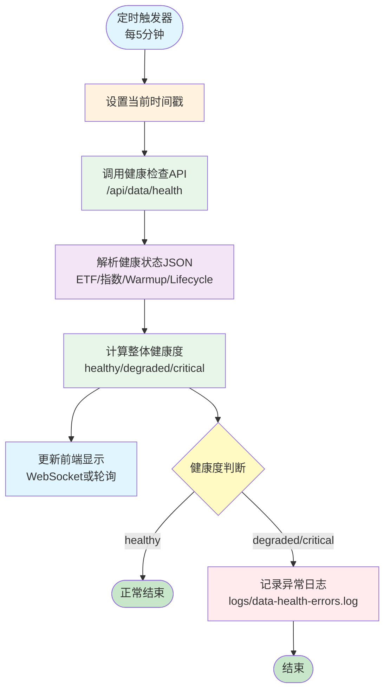

# 数据流程监控 - 架构图

## Mermaid流程图



## 数据流说明

### 1. 定时触发
- **频率**: 每5分钟
- **触发器**: n8n Cron节点
- **输出**: 当前时间戳

### 2. 健康检查
- **API**: `GET /api/data/health`
- **返回格式**:
```json
{
  "timestamp": "2026-04-15T12:00:00Z",
  "health": "healthy",
  "sources": {
    "etf": {
      "total": 9,
      "ok": 9,
      "delayed": 0,
      "failed": 0
    },
    "index": {...},
    "warmup": {...},
    "lifecycle": {...}
  },
  "summary": {
    "total": 15,
    "passed": 14,
    "failed": 1,
    "passRate": "93.3%"
  }
}
```

### 3. 健康度计算

#### healthy (健康)
- 通过率 ≥ 90%
- 所有数据源正常
- 前端显示绿色 ✅

#### degraded (降级)
- 通过率 70% - 90%
- 部分数据源延迟
- 前端显示黄色 ⚠️

#### critical (异常)
- 通过率 < 70%
- 多个数据源失败
- 前端显示红色 ❌

### 4. 异常处理

当健康度为 `degraded` 或 `critical` 时：
1. 记录异常日志到 `logs/data-health-errors.log`
2. 日志格式：
   ```
   2026-04-15 12:00:00 - 健康度异常: degraded
   {
     "timestamp": "2026-04-15T12:00:00Z",
     "health": "degraded",
     "sources": {...},
     "summary": {...}
   }
   ```

## 前端监控界面

### 位置
- 文件: `public/index.html`
- Section: "📊 数据流程状态监控"
- 显示在: "板块生命周期监测"之前

### 显示内容

#### 整体健康度
- ✅ 健康 (绿色)
- ⚠️ 降级 (黄色)
- ❌ 异常 (红色)

#### 数据源状态卡片
1. **📈 ETF数据**
   - 总数: 9
   - ✅ 正常: X
   - ⚠️ 延迟: X
   - ❌ 失败: X

2. **📊 指数数据**
   - 上证指数、深证成指、创业板指、科创板指

3. **🔥 Warmup缓存**
   - 最新日期
   - 记录数量

4. **🎯 Lifecycle分析**
   - 最新日期
   - 项目数量

#### 详细信息
- 可展开查看完整JSON
- 按钮: "显示详细信息 ▼"

## 自动刷新

- **频率**: 每5分钟
- **实现**: JavaScript `setInterval()`
- **首次加载**: 立即执行一次

## 文件结构

```
a-stock-monitor/
├── scripts/
│   └── get_data_health.py          # 数据健康检查脚本
├── server.js                        # 添加 /api/data/health 端点
├── public/
│   ├── index.html                   # 添加监控section
│   └── ui.js                        # 添加刷新逻辑
├── n8n-workflows/
│   ├── data-monitoring-workflow.json  # n8n工作流配置
│   ├── README.md                    # 使用说明
│   └── flowchart.md                # 架构图（本文件）
└── logs/
    └── data-health-errors.log      # 异常日志（自动创建）
```

## 部署步骤

### Step 1: 安装n8n
```bash
npm install -g n8n
```

### Step 2: 启动n8n
```bash
n8n start
# 访问: http://localhost:5678
```

### Step 3: 导入工作流
1. 打开n8n界面
2. 点击右上角 "..." → "Import from File"
3. 选择 `data-monitoring-workflow.json`

### Step 4: 激活工作流
1. 点击左上角的 "Inactive" 开关
2. 切换为 "Active"

### Step 5: 验证
1. 点击 "Execute Workflow" 手动测试
2. 打开前端页面查看监控界面
3. 检查日志文件 `logs/data-health-errors.log`

## 下一步扩展

### 阶段2: LangGraph智能分析

当检测到异常时，自动调用LangGraph进行问题分析：

```
[❌ 健康度异常]
      ↓
[🤖 LangGraph分析]
  ├─ Agent 1: 数据诊断专家
  ├─ Agent 2: 根因分析专家
  ├─ Agent 3: 解决方案专家
  └─ Agent 4: 影响评估专家
      ↓
[📊 分析报告]
  ├─ 问题原因
  ├─ 解决方案
  ├─ 影响范围
  └─ 可执行命令
```

### 阶段3: 通知和报警

- Email通知
- Slack集成
- Discord Webhook
- 企业微信机器人

### 阶段4: 自动修复

- 自动重试失败的数据采集
- 自动回填缺失数据
- 自动重启异常服务

---

# 全量工作流清单

> 按调用顺序排列。每个工作流独立导入 n8n 激活。

| 编号 | 文件 | 作用 | 触发方式 | 频率 |
|------|------|------|----------|------|
| M1-A | `M1-A-Index-Minute-Fetch.json` | 大盘指数分钟线采集 | 定时 | 每分钟 |
| M1-B | `M1-B-Minute2Daily.json` | 大盘指数分钟线→日线 | 定时 | 收盘后 |
| M1-B-S | `M1-B-Sector-Minute-Fetch.json` | 板块分钟线采集 | 定时 | 每分钟 |
| M1-C | `M1-C-ETF-Minute-Fetch.json` | ETF 分钟线采集 | 定时 | 每分钟 |
| M1-D | `M1-D-ETF-Minute2Daily.json` | ETF 分钟线→日线 | 定时 | 收盘后 |
| M1-E | `M1-E-Backfill-Universal.json` | 通用回补（指数/ETF分钟线+日线） | 手动/n8n | 按需 |
| M1-F | `M1-F-Cleanup-Minute.json` | 清理过期分钟线文件 | 定时 | 每日 |
| M1-G | `M1-G-Warmup-Lifecycle.json` | Warmup 缓存 + 板块生命周期 | 定时 | 收盘后 |
| M1-H | `M1-H-Stage-Snapshot.json` | **波段交易助手：五阶段快照（日线+分时）** | 定时 | 每 5 分钟 |
| — | `M1-AI-Intraday-Report.json` | AI 大盘日内报告 | 定时 | 盘中 |
| — | `M1-AI-ETF-Intraday-Report.json` | AI ETF 日内报告 | 定时 | 盘中 |
| — | `M1-Breadth-Fetch.json` | 涨跌家数采集 | 定时 | 每分钟 |
| — | `M1-Market-Amount.json` | 市场总成交额采集 | 定时 | 每分钟 |

---

## M1-H-Stage-Snapshot：波段交易助手阶段快照

### 用途

为交易助手页提供**盘中实时**的五阶段数据（主升/启动/震荡/下跌/防守），替代原来基于昨日收盘价的滞后的阶段判断。

### 数据流

```
[⏰ 定时触发] 每5分钟
     ↓
[🌐 HTTP POST] http://host.docker.internal:8787/api/trade/run-stage-snapshot
     ↓
[📄 落盘]  data/stage/snapshot.json
     ↓
 API GET /api/trade/stage_snapshot → 前端交易助手页 30s 轮询
```

### 节点说明

| 节点 | 类型 | 说明 |
|------|------|------|
| 每5分钟触发 | Schedule Trigger | Cron 每 5 分钟触发一次 |
| 生成阶段快照 | HTTP Request | POST `http://host.docker.internal:8787/api/trade/run-stage-snapshot`，服务端内部 execFile `stage_runner.py --use-minute --output-snapshot` |

### --use-minute 行为

- **盘中（9:30-15:00）**：读取 `data/etf/minute/{sym}/{当天}.jsonl` 最新分钟价拼入日线末尾，用实时价做阶段判断 + 计算 MA20
- **盘后/非交易日**：分钟线为空，退化为日线最后一条数据（与 `--day today` 等价）

### 下游消费者

- `GET /api/trade/stage_snapshot`（优先读快照，~5ms）
- 降级：快照不存在时 execFile `stage_runner.py`

### 部署说明

1. n8n 导入 `M1-H-Stage-Snapshot.json`
2. 确认容器内 8787 服务可达（`http://host.docker.internal:8787`）
3. 激活工作流
4. 替代方案：代码内置 `setInterval` 定时器（`pages/trade/server.js`），无需 n8n

### 备用：代码内置定时器

若不使用 n8n，`pages/trade/server.js` 启动时已内置 5 分钟定时调用：

```js
setInterval(() => {
  execFile('python3', ['波段策略/stage_runner.py', '--use-minute', '--output-snapshot'], {
    cwd: ROOT, timeout: 20000
  }, (err, stdout, stderr) => {
    if (err) console.error('[stage-snapshot]', String(stderr || err.message).slice(0, 100));
  });
}, 5 * 60 * 1000);
```

n8n 上线后删除这段代码即可，避免重复执行。
